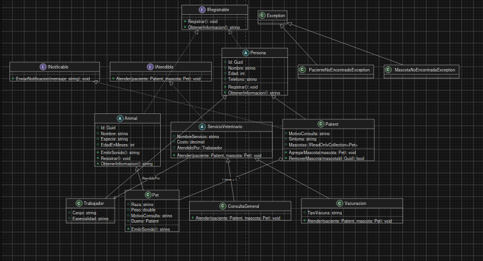

# Sistema de Gestion de Clinica Veterinaria

Proyecto desarrollado en C# y .NET como parte del modulo de aprendizaje de Programacion Orientada a Objetos y desarrollo en .NET (Semana 5).

---

## Descripcion del Proyecto

Este proyecto es una aplicacion de consola diseñada para simular la gestion basica de una clinica veterinaria. Permite registrar clientes (pacientes/dueños), asociarles mascotas, realizar consultas medicas, buscar informacion con LINQ, manejar errores con un sistema de logs y ejecutar tareas en segundo plano usando programacion asincrona.

---

## Conceptos de C# aplicados en el proyecto

A lo largo de estas 5 semanas de aprendizaje se integraron los siguientes temas:

1. **Programacion Orientada a Objetos (POO):**
   - **Clases y Objetos:** Modelado de entidades reales (`Persona`, `Animal`, `Patient`, `Pet`, `Trabajador`).
   - **Encapsulamiento:** Uso de propiedades con getters y setters, colecciones de solo lectura (`IReadOnlyCollection`) para proteger las listas internas.
   - **Herencia:** `Patient` hereda de `Persona`, y `Pet` hereda de `Animal`.
   - **Polimorfismo:** Sobrescritura de metodos como `EmitirSonido()` en las mascotas y el metodo `Atender()` en los servicios medicos (`ConsultaGeneral`, `Vacunacion`).

2. **Uso de Interfaces:**
   - Implementacion de multiples contratos en una misma clase (`Patient` implementa `IRegistrable` a traves de su clase base y `INotificable` directamente).
   - Uso de interfaces para desacoplar el acceso a datos (`IClienteRepository`, `IMascotaRepository`) y servicios (`IAtendible`, `IPatientService`).

3. **Consultas con LINQ:**
   - Filtrado y seleccion de datos.
   - Agrupamiento de mascotas por su especie (`GroupBy`).

4. **Manejo de Excepciones y Logging:**
   - Creacion de excepciones personalizadas (`PacienteNoEncontradoException`, `MascotaNoEncontradaException`).
   - Control de fallos con bloques `try-catch`.
   - Servicio basico de registro de eventos y errores (`LoggerService`) que guarda los mensajes en un archivo `app.log`.

5. **Programacion Asincrona (async / await):**
   - Simulacion de operaciones que toman tiempo mediante `Task.Delay`.
   - Uso de `Task.WhenAny` para detectar la primera tarea en finalizar y `Task.WhenAll` para procesar multiples mascotas en paralelo sin bloquear la aplicacion.

6. **Pruebas Unitarias (Unit Testing):**
   - Proyecto de pruebas con xUnit (`VeterinaryClinicSystem.Test`) para validar las reglas de negocio y los casos de uso principales.

---

## Diagrama de Clases UML

```mermaid
classDiagram
    direction TB

    %% ==========================================
    %% CAPA DE DOMINIO - INTERFACES
    %% ==========================================
    class IRegistrable {
        <<interface>>
        +Registrar() void
        +ObtenerInformacion() string
    }

    class INotificable {
        <<interface>>
        +EnviarNotificacion(string mensaje) void
    }

    class IAtendible {
        <<interface>>
        +Atender(Patient paciente, Pet mascota) void
    }

    %% ==========================================
    %% CAPA DE DOMINIO - MODELOS
    %% ==========================================
    class Persona {
        <<abstract>>
        +Guid Id
        +string Nombre
        +int Edad
        -string _telefono
        +string Telefono
        +Registrar() void
        +ObtenerInformacion()* string
    }

    class Patient {
        -List~Pet~ _mascotas
        +string MotivoConsulta
        +string Sintoma
        +IReadOnlyCollection~Pet~ Mascotas
        +AgregarMascota(Pet mascota) void
        +RemoverMascota(Guid mascotaId) bool
        +ObtenerInformacion() string
        +EnviarNotificacion(string mensaje) void
    }

    class Trabajador {
        +string Cargo
        +string Especialidad
        +ObtenerInformacion() string
    }

    class Animal {
        <<abstract>>
        +Guid Id
        +string Nombre
        +int EdadEnMeses
        +string Especie
        +EmitirSonido() string
        +Registrar() void
        +ObtenerInformacion()* string
    }

    class Pet {
        +double Peso
        +string MotivoConsulta
        +string Raza
        +Patient Dueno
        +bool EsCallejera
        +EmitirSonido() string
        +ObtenerInformacion() string
    }

    %% ==========================================
    %% SERVICIOS VETERINARIOS Y POLIMORFISMO
    %% ==========================================
    class ServicioVeterinario {
        <<abstract>>
        +string NombreServicio
        +decimal Costo
        +Trabajador AtendidoPor
        +Atender(Patient paciente, Pet mascota)* void
    }

    class ConsultaGeneral {
        +Atender(Patient paciente, Pet mascota) void
    }

    class Vacunacion {
        +string TipoVacuna
        +Atender(Patient paciente, Pet mascota) void
    }

    %% ==========================================
    %% CAPA DE ACCESO A DATOS (REPOSITORIOS)
    %% ==========================================
    class IClienteRepository {
        <<interface>>
        +Agregar(Patient cliente) void
        +AgregarAsync(Patient cliente) Task
        +ObtenerTodos() IReadOnlyList~Patient~
        +ObtenerTodosAsync() Task~IReadOnlyList~Patient~~
        +ObtenerPorId(Guid id) Patient
        +ObtenerPorNombre(string nombre) Patient
        +Actualizar(Patient cliente) bool
        +Eliminar(Guid id) bool
    }

    class IMascotaRepository {
        <<interface>>
        +Agregar(Pet mascota, Guid clienteId) void
        +AgregarAsync(Pet mascota, Guid clienteId) Task
        +ObtenerTodas() IReadOnlyList~Pet~
        +ObtenerPorClienteId(Guid clienteId) IReadOnlyList~Pet~
        +ObtenerSinDueno() IReadOnlyList~Pet~
        +ObtenerPorId(Guid id) Pet
        +DesvincularMascotasDeCliente(Guid clienteId) bool
        +Eliminar(Guid id) bool
    }

    class ClienteRepository {
        -ConcurrentDictionary _clientesPorId
        +Agregar(Patient cliente) void
        +AgregarAsync(Patient cliente) Task
        +ObtenerTodos() IReadOnlyList~Patient~
        +ObtenerPorId(Guid id) Patient
        +Actualizar(Patient cliente) bool
        +Eliminar(Guid id) bool
    }

    class MascotaRepository {
        -ConcurrentDictionary _mascotasPorId
        +Agregar(Pet mascota, Guid clienteId) void
        +AgregarAsync(Pet mascota, Guid clienteId) Task
        +ObtenerTodas() IReadOnlyList~Pet~
        +ObtenerPorClienteId(Guid clienteId) IReadOnlyList~Pet~
        +ObtenerSinDueno() IReadOnlyList~Pet~
        +DesvincularMascotasDeCliente(Guid clienteId) bool
        +Eliminar(Guid id) bool
    }

    %% ==========================================
    %% CAPA DE NEGOCIO Y PRESENTACIÓN
    %% ==========================================
    class IPatientService {
        <<interface>>
        +ObtenerTodosLosPacientes() IReadOnlyList~Patient~
        +RegistrarPaciente(string nombre, int edad, string sintoma, string telefono) Patient
        +RegistrarPacienteAsync(string nombre, int edad, string sintoma, string telefono) Task~Patient~
        +RegistrarMascota(Guid clienteId, string nombre, int edadEnMeses, double peso, string motivo, string especie, string raza) Pet
        +RegistrarMascotaAsync(Guid clienteId, string nombre, int edadEnMeses, double peso, string motivo, string especie, string raza) Task~Pet~
        +BuscarMascotaDePaciente(string nombrePaciente, string nombreMascota) Pet
        +SimularProcesosParalelosClinicaAsync(string nombrePaciente) Task
        +SimularAtencionConcurrentesMascotasAsync() Task
    }

    class PatientService {
        -IClienteRepository _clienteRepository
        -IMascotaRepository _mascotaRepository
        +RegistrarPaciente(...) Patient
        +RegistrarPacienteAsync(...) Task~Patient~
        +RegistrarMascota(...) Pet
        +BuscarMascotaDePaciente(...) Pet
        +SimularProcesosParalelosClinicaAsync(...) Task
        +SimularAtencionConcurrentesMascotasAsync(...) Task
    }

    class ConsoleUI {
        -IPatientService _patientService
        +IniciarAsync() Task
    }

    %% ==========================================
    %% RELACIONES
    %% ==========================================
    %% Dominio: Herencia e Implementación
    IRegistrable <|.. Persona
    IRegistrable <|.. Animal
    Persona <|-- Patient
    Persona <|-- Trabajador
    Animal <|-- Pet
    INotificable <|.. Patient

    %% Asociación / Composición entre Entidades
    Patient "1" o-- "0..*" Pet : _mascotas
    Pet --> "0..1" Patient : Dueno

    %% Polimorfismo en Servicios Médicos
    IAtendible <|.. ServicioVeterinario
    ServicioVeterinario <|-- ConsultaGeneral
    ServicioVeterinario <|-- Vacunacion
    ServicioVeterinario --> Trabajador : AtendidoPor

    %% Arquitectura e Inyección de Dependencias
    IClienteRepository <|.. ClienteRepository
    IMascotaRepository <|.. MascotaRepository
    IPatientService <|.. PatientService
    PatientService --> IClienteRepository : Inyección
    PatientService --> IMascotaRepository : Inyección
    ConsoleUI --> IPatientService : Inyección
```





---

## Estructura de Carpetas

```text
artyomalvarez-VeterinaryClinicSystem/
├── VeterinaryClinicSystem/
│   ├── Exceptions/           # Excepciones personalizadas del dominio
│   ├── Models/               # Clases principales e interfaces (IRegistrable, INotificable)
│   ├── Repositories/         # Repositorios en memoria para guardar datos
│   ├── Services/             # Logica del negocio (servicios veterinarios, paciente, logger)
│   ├── UI/                   # Menu de consola interactivo (ConsoleUI)
│   └── Program.cs            # Punto de inicio del programa
├── VeterinaryClinicSystem.Test/
│   └── UnitTest1.cs          # Pruebas unitarias con xUnit
├── docs/                     # Diagramas e imagenes
└── README.md                 # Documentacion del proyecto
```

---

## Requisitos

- .NET SDK (version 10.0 o superior instalada en el equipo).
- Terminal o consola de comandos (Bash, PowerShell o CMD).

---

## Instrucciones para ejecutar el proyecto

1. Abrir la terminal en la carpeta principal del proyecto.

2. Compilar el proyecto para verificar que no existan errores:
   ```bash
   dotnet build
   ```

3. Iniciar la aplicacion de consola:
   ```bash
   dotnet run --project VeterinaryClinicSystem
   ```

---

## Como ejecutar las pruebas unitarias

Para correr las 16 pruebas unitarias automatizadas con xUnit y validar el correcto funcionamiento del sistema:

```bash
dotnet test
```

---

## Autor

- Proyecto desarrollado por **Juan Jose Alvarez Manjarrez**.
