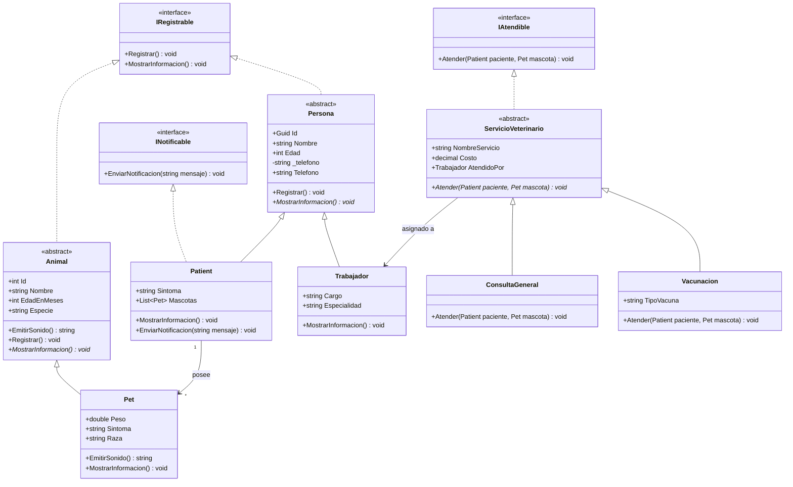

# artyomalvarez-VeterinaryClinicSystem
Sistema de gestión de clínicas veterinarias desarrollado con C# y .NET.

## 📐 Diagrama de Clases UML (Historia M5.3S3)

```mermaid
classDiagram
    class IRegistrable {
        <<interface>>
        +Registrar() void
        +MostrarInformacion() void
    }

    class INotificable {
        <<interface>>
        +EnviarNotificacion(string mensaje) void
    }

    class IAtendible {
        <<interface>>
        +Atender(Patient paciente, Pet mascota) void
    }

    class Persona {
        <<abstract>>
        +Guid Id
        +string Nombre
        +int Edad
        -string _telefono
        +string Telefono
        +Registrar() void
        +MostrarInformacion()* void
    }

    class Animal {
        <<abstract>>
        +int Id
        +string Nombre
        +int EdadEnMeses
        +string Especie
        +EmitirSonido() string
        +Registrar() void
        +MostrarInformacion()* void
    }

    class Patient {
        +string Sintoma
        +List~Pet~ Mascotas
        +MostrarInformacion() void
        +EnviarNotificacion(string mensaje) void
    }

    class Trabajador {
        +string Cargo
        +string Especialidad
        +MostrarInformacion() void
    }

    class Pet {
        +double Peso
        +string Sintoma
        +string Raza
        +EmitirSonido() string
        +MostrarInformacion() void
    }

    class ServicioVeterinario {
        <<abstract>>
        +string NombreServicio
        +decimal Costo
        +Trabajador AtendidoPor
        +Atender(Patient paciente, Pet mascota)* void
    }

    class ConsultaGeneral {
        +Atender(Patient paciente, Pet mascota) void
    }

    class Vacunacion {
        +string TipoVacuna
        +Atender(Patient paciente, Pet mascota) void
    }

    IRegistrable <|.. Persona
    IRegistrable <|.. Animal
    INotificable <|.. Patient
    IAtendible <|.. ServicioVeterinario
    Persona <|-- Patient
    Persona <|-- Trabajador
    Animal <|-- Pet
    Patient "1" --> "*" Pet : posee
    ServicioVeterinario <|-- ConsultaGeneral
    ServicioVeterinario <|-- Vacunacion
    ServicioVeterinario --> Trabajador : asignado a
```
